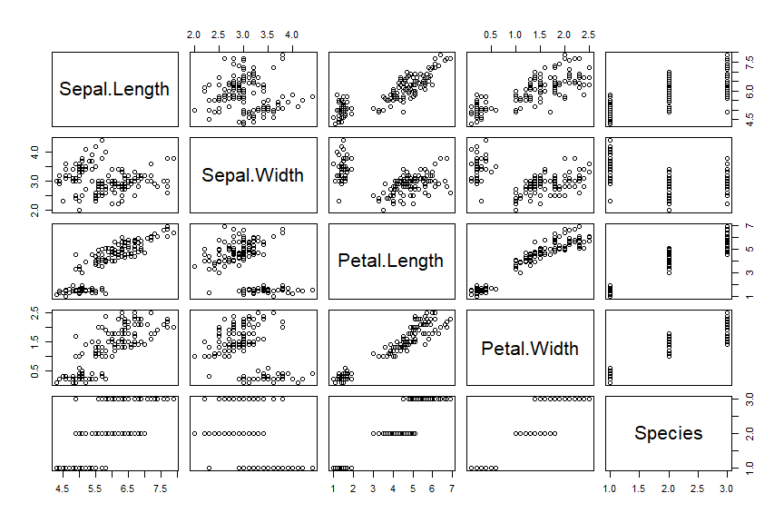

## R Markdown

Ini merupakan dokumen R Markdown yang dapat digunakan untuk membuat dokumen HTML, PDF, dan bahkan dokumen berekstensi docx atau odt. Anda dapat membuat dokumen tulisan, salindia presentasi, dan laman web statis maupun interaktif dengan melalui R Markdown. Penggunaan R Markdown dalam proyek analisis data akan membuat alur kerja menjadi lebih mudah dan *reproducible*. Informasi lebih lanjut mengenai R Markdown dapat dilihat pada pranala [ini](http://rmarkdown.rstudio.com).

Kode R dapat dimasukan ke dalam dokumen R Markdown dengan menggunakan *chunck* yang dimulai dengan penanda  tiga *backtick* '```' (dibuat dengan klik tombol Insert - R). Contoh cara untuk penulisan kode R kedalam dokumen R Markdown adalah sebagai berikut:


```r
mtcars
```

```
##                      mpg cyl  disp  hp drat    wt  qsec vs am gear carb
## Mazda RX4           21.0   6 160.0 110 3.90 2.620 16.46  0  1    4    4
## Mazda RX4 Wag       21.0   6 160.0 110 3.90 2.875 17.02  0  1    4    4
## Datsun 710          22.8   4 108.0  93 3.85 2.320 18.61  1  1    4    1
## Hornet 4 Drive      21.4   6 258.0 110 3.08 3.215 19.44  1  0    3    1
## Hornet Sportabout   18.7   8 360.0 175 3.15 3.440 17.02  0  0    3    2
## Valiant             18.1   6 225.0 105 2.76 3.460 20.22  1  0    3    1
## Duster 360          14.3   8 360.0 245 3.21 3.570 15.84  0  0    3    4
## Merc 240D           24.4   4 146.7  62 3.69 3.190 20.00  1  0    4    2
## Merc 230            22.8   4 140.8  95 3.92 3.150 22.90  1  0    4    2
## Merc 280            19.2   6 167.6 123 3.92 3.440 18.30  1  0    4    4
## Merc 280C           17.8   6 167.6 123 3.92 3.440 18.90  1  0    4    4
## Merc 450SE          16.4   8 275.8 180 3.07 4.070 17.40  0  0    3    3
## Merc 450SL          17.3   8 275.8 180 3.07 3.730 17.60  0  0    3    3
## Merc 450SLC         15.2   8 275.8 180 3.07 3.780 18.00  0  0    3    3
## Cadillac Fleetwood  10.4   8 472.0 205 2.93 5.250 17.98  0  0    3    4
## Lincoln Continental 10.4   8 460.0 215 3.00 5.424 17.82  0  0    3    4
## Chrysler Imperial   14.7   8 440.0 230 3.23 5.345 17.42  0  0    3    4
## Fiat 128            32.4   4  78.7  66 4.08 2.200 19.47  1  1    4    1
## Honda Civic         30.4   4  75.7  52 4.93 1.615 18.52  1  1    4    2
## Toyota Corolla      33.9   4  71.1  65 4.22 1.835 19.90  1  1    4    1
## Toyota Corona       21.5   4 120.1  97 3.70 2.465 20.01  1  0    3    1
## Dodge Challenger    15.5   8 318.0 150 2.76 3.520 16.87  0  0    3    2
## AMC Javelin         15.2   8 304.0 150 3.15 3.435 17.30  0  0    3    2
## Camaro Z28          13.3   8 350.0 245 3.73 3.840 15.41  0  0    3    4
## Pontiac Firebird    19.2   8 400.0 175 3.08 3.845 17.05  0  0    3    2
## Fiat X1-9           27.3   4  79.0  66 4.08 1.935 18.90  1  1    4    1
## Porsche 914-2       26.0   4 120.3  91 4.43 2.140 16.70  0  1    5    2
## Lotus Europa        30.4   4  95.1 113 3.77 1.513 16.90  1  1    5    2
## Ford Pantera L      15.8   8 351.0 264 4.22 3.170 14.50  0  1    5    4
## Ferrari Dino        19.7   6 145.0 175 3.62 2.770 15.50  0  1    5    6
## Maserati Bora       15.0   8 301.0 335 3.54 3.570 14.60  0  1    5    8
## Volvo 142E          21.4   4 121.0 109 4.11 2.780 18.60  1  1    4    2
```

```r
head(mtcars) # melihat 6 baris pertama dari data mtcars, mtcars adalah data bawaan yang tersedia di R
```

```
##                    mpg cyl disp  hp drat    wt  qsec vs am gear carb
## Mazda RX4         21.0   6  160 110 3.90 2.620 16.46  0  1    4    4
## Mazda RX4 Wag     21.0   6  160 110 3.90 2.875 17.02  0  1    4    4
## Datsun 710        22.8   4  108  93 3.85 2.320 18.61  1  1    4    1
## Hornet 4 Drive    21.4   6  258 110 3.08 3.215 19.44  1  0    3    1
## Hornet Sportabout 18.7   8  360 175 3.15 3.440 17.02  0  0    3    2
## Valiant           18.1   6  225 105 2.76 3.460 20.22  1  0    3    1
```

Jika ingin menjalankan kode R dalam *chunck* tersebut, Anda dapat menggunakan pemintas Ctrl + Enter (menjalankan satu baris kode) atau Ctrl + Shift + Enter (menjalankan semua kode dalam *chunck*). Sekarang buatlah *chunck* baru yang isinya adalah baris kode R berikut: (Petunjuk: Gunakan Ctrl + Alt + I)

filled.contour(volcano,
               color.palette = terrain.colors, 
               plot.title = title("Topografi Gunung Maunga Whau"), 
               key.title = title("Tinggi\n(meter)"))

Setelah selesai membuat dokumen R Markdown yang berisikan konten tulisan beserta kode R, Anda dapat klik tombol **Knit** untuk menghasilkan dokumen baru sesuai dengan format dokumen yang diinginkan. Dalam contoh ini format dokumen keluaran R Markdown setelah menjalankan **Knit** adalah dokumen HTML. Anda dapat mengatur format dokumen keluaran dengan cara mengubah baris *output* pada YAML metadata (lihat baris paling atas dokumen ini) seperti contoh berikut:

```
---
title: "Pendahuluan"
author: "Muhammad Aswan Syahputra"
date: "4/9/2019"
output: pdf_document
editor_options: 
  chunk_output_type: console
---
```

## Struktur Data

Struktur data pada R dapat dikategorikan berdasarkan dimensi dan homogenitas dari elemen. Data satu dimensi dengan elemen yang homogen disebut sebagai *atomic vector*, sedangkan jika heterogen disebut sebagai *list*. Cara untuk membuat *atomic vectors* adalah dengan menggunakan fungsi `c()`, sedangkan untuk *list* dapat dibuat dengan menggunakan fungsi `list()`. Salah satu cara untuk memberikan nama pada objek data adalah dengan menggunakan tanda `<-`. Perhatikan contoh berikut:


```r
c(1, 2, 3, 4)
```

```
## [1] 1 2 3 4
```

```r
c("r", "academy", "telkom", "university")
```

```
## [1] "r"          "academy"    "telkom"     "university"
```

```r
list(15, "r", "TRUE", 24L)
```

```
## [[1]]
## [1] 15
## 
## [[2]]
## [1] "r"
## 
## [[3]]
## [1] "TRUE"
## 
## [[4]]
## [1] 24
```

```r
huruf_vokal <- c("a", "i", "u", "e", "o") # objek data tersimpan dengan nama 'huruf_vokal', namun tidak tercetak pada konsol
huruf_vokal # mencetak objek data dengan nama 'huruf_vokal' pada konsol
```

```
## [1] "a" "i" "u" "e" "o"
```

Jenis dari data dapat diketahui dengan menggunakan fungsi `typeof()`. Dapatkah Anda mengetahui jenis data dari 'huruf_vokal' diatas? Bagaimana jika Anda membuat objek data dengan menggunakan fungsi `c()` namun jenis elemennya berbeda-beda? Dapatkah Anda menjelaskannya? Isilah '___' dengan jawaban yang sesuai!


```r
typeof(huruf_vokal)
```

```
## [1] "character"
```

```r
beragam <- c(2.7, "berbeda", TRUE, 4L) # 2.7 bertipe double, "berbeda" bertipe character, TRUE bertipe logical, 4L bertipe integer
typeof(beragam) # cek tipe dari objek data dengan nama 'beragam'
```

```
## [1] "character"
```

```r
beragam
```

```
## [1] "2.7"     "berbeda" "TRUE"    "4"
```

Struktur data dua dimensi merupakan yang paling banyak digunakan di R, yaitu matrix dan dataframe yang dapat dibuat dengan menggunakan fungsi `matrix()` dan `data.frame()`. Kedua data tersebut umumnya jarang dibuat secara langsung di R, notabene berasal dari berkas luar atau merupakan hasil dari penggunaan fungsi. Prinsipnya suatu dataframe merupakan gabungan dari beberapa data satu dimensi dengan jumlah yang sama, umumnya adalah *atomic vectors*. Menurut Anda, dapatkah suatu frame tersusun atas beberapa *list* dengan jumlah yang sama?

## Fungsi

Fungsi memiliki tugas utama untuk mengolah suatu *input* menjadi *output*. Anda dapat melihat dan membaca dokumentasi dari suatu fungsi dengan menjalankan `?nama_fungsi` atau `help(nama_fungsi)`. Di bawah ini merupakan beberapa fungsi dasar yang dapat Anda gunakan untuk mengolah objek data dengan nama 'iris' sebagai *input*. Buatlah catatan singkat mengenai kegunaan dari setiap fungsi yang digunakan!


```r
iris # mencetak data di konsol
```

```
##     Sepal.Length Sepal.Width Petal.Length Petal.Width    Species
## 1            5.1         3.5          1.4         0.2     setosa
## 2            4.9         3.0          1.4         0.2     setosa
## 3            4.7         3.2          1.3         0.2     setosa
## 4            4.6         3.1          1.5         0.2     setosa
## 5            5.0         3.6          1.4         0.2     setosa
## 6            5.4         3.9          1.7         0.4     setosa
## 7            4.6         3.4          1.4         0.3     setosa
## 8            5.0         3.4          1.5         0.2     setosa
## 9            4.4         2.9          1.4         0.2     setosa
## 10           4.9         3.1          1.5         0.1     setosa
## 11           5.4         3.7          1.5         0.2     setosa
## 12           4.8         3.4          1.6         0.2     setosa
## 13           4.8         3.0          1.4         0.1     setosa
## 14           4.3         3.0          1.1         0.1     setosa
## 15           5.8         4.0          1.2         0.2     setosa
## 16           5.7         4.4          1.5         0.4     setosa
## 17           5.4         3.9          1.3         0.4     setosa
## 18           5.1         3.5          1.4         0.3     setosa
## 19           5.7         3.8          1.7         0.3     setosa
## 20           5.1         3.8          1.5         0.3     setosa
## 21           5.4         3.4          1.7         0.2     setosa
## 22           5.1         3.7          1.5         0.4     setosa
## 23           4.6         3.6          1.0         0.2     setosa
## 24           5.1         3.3          1.7         0.5     setosa
## 25           4.8         3.4          1.9         0.2     setosa
## 26           5.0         3.0          1.6         0.2     setosa
## 27           5.0         3.4          1.6         0.4     setosa
## 28           5.2         3.5          1.5         0.2     setosa
## 29           5.2         3.4          1.4         0.2     setosa
## 30           4.7         3.2          1.6         0.2     setosa
## 31           4.8         3.1          1.6         0.2     setosa
## 32           5.4         3.4          1.5         0.4     setosa
## 33           5.2         4.1          1.5         0.1     setosa
## 34           5.5         4.2          1.4         0.2     setosa
## 35           4.9         3.1          1.5         0.2     setosa
## 36           5.0         3.2          1.2         0.2     setosa
## 37           5.5         3.5          1.3         0.2     setosa
## 38           4.9         3.6          1.4         0.1     setosa
## 39           4.4         3.0          1.3         0.2     setosa
## 40           5.1         3.4          1.5         0.2     setosa
## 41           5.0         3.5          1.3         0.3     setosa
## 42           4.5         2.3          1.3         0.3     setosa
## 43           4.4         3.2          1.3         0.2     setosa
## 44           5.0         3.5          1.6         0.6     setosa
## 45           5.1         3.8          1.9         0.4     setosa
## 46           4.8         3.0          1.4         0.3     setosa
## 47           5.1         3.8          1.6         0.2     setosa
## 48           4.6         3.2          1.4         0.2     setosa
## 49           5.3         3.7          1.5         0.2     setosa
## 50           5.0         3.3          1.4         0.2     setosa
## 51           7.0         3.2          4.7         1.4 versicolor
## 52           6.4         3.2          4.5         1.5 versicolor
## 53           6.9         3.1          4.9         1.5 versicolor
## 54           5.5         2.3          4.0         1.3 versicolor
## 55           6.5         2.8          4.6         1.5 versicolor
## 56           5.7         2.8          4.5         1.3 versicolor
## 57           6.3         3.3          4.7         1.6 versicolor
## 58           4.9         2.4          3.3         1.0 versicolor
## 59           6.6         2.9          4.6         1.3 versicolor
## 60           5.2         2.7          3.9         1.4 versicolor
## 61           5.0         2.0          3.5         1.0 versicolor
## 62           5.9         3.0          4.2         1.5 versicolor
## 63           6.0         2.2          4.0         1.0 versicolor
## 64           6.1         2.9          4.7         1.4 versicolor
## 65           5.6         2.9          3.6         1.3 versicolor
## 66           6.7         3.1          4.4         1.4 versicolor
## 67           5.6         3.0          4.5         1.5 versicolor
## 68           5.8         2.7          4.1         1.0 versicolor
## 69           6.2         2.2          4.5         1.5 versicolor
## 70           5.6         2.5          3.9         1.1 versicolor
## 71           5.9         3.2          4.8         1.8 versicolor
## 72           6.1         2.8          4.0         1.3 versicolor
## 73           6.3         2.5          4.9         1.5 versicolor
## 74           6.1         2.8          4.7         1.2 versicolor
## 75           6.4         2.9          4.3         1.3 versicolor
## 76           6.6         3.0          4.4         1.4 versicolor
## 77           6.8         2.8          4.8         1.4 versicolor
## 78           6.7         3.0          5.0         1.7 versicolor
## 79           6.0         2.9          4.5         1.5 versicolor
## 80           5.7         2.6          3.5         1.0 versicolor
## 81           5.5         2.4          3.8         1.1 versicolor
## 82           5.5         2.4          3.7         1.0 versicolor
## 83           5.8         2.7          3.9         1.2 versicolor
## 84           6.0         2.7          5.1         1.6 versicolor
## 85           5.4         3.0          4.5         1.5 versicolor
## 86           6.0         3.4          4.5         1.6 versicolor
## 87           6.7         3.1          4.7         1.5 versicolor
## 88           6.3         2.3          4.4         1.3 versicolor
## 89           5.6         3.0          4.1         1.3 versicolor
## 90           5.5         2.5          4.0         1.3 versicolor
## 91           5.5         2.6          4.4         1.2 versicolor
## 92           6.1         3.0          4.6         1.4 versicolor
## 93           5.8         2.6          4.0         1.2 versicolor
## 94           5.0         2.3          3.3         1.0 versicolor
## 95           5.6         2.7          4.2         1.3 versicolor
## 96           5.7         3.0          4.2         1.2 versicolor
## 97           5.7         2.9          4.2         1.3 versicolor
## 98           6.2         2.9          4.3         1.3 versicolor
## 99           5.1         2.5          3.0         1.1 versicolor
## 100          5.7         2.8          4.1         1.3 versicolor
## 101          6.3         3.3          6.0         2.5  virginica
## 102          5.8         2.7          5.1         1.9  virginica
## 103          7.1         3.0          5.9         2.1  virginica
## 104          6.3         2.9          5.6         1.8  virginica
## 105          6.5         3.0          5.8         2.2  virginica
## 106          7.6         3.0          6.6         2.1  virginica
## 107          4.9         2.5          4.5         1.7  virginica
## 108          7.3         2.9          6.3         1.8  virginica
## 109          6.7         2.5          5.8         1.8  virginica
## 110          7.2         3.6          6.1         2.5  virginica
## 111          6.5         3.2          5.1         2.0  virginica
## 112          6.4         2.7          5.3         1.9  virginica
## 113          6.8         3.0          5.5         2.1  virginica
## 114          5.7         2.5          5.0         2.0  virginica
## 115          5.8         2.8          5.1         2.4  virginica
## 116          6.4         3.2          5.3         2.3  virginica
## 117          6.5         3.0          5.5         1.8  virginica
## 118          7.7         3.8          6.7         2.2  virginica
## 119          7.7         2.6          6.9         2.3  virginica
## 120          6.0         2.2          5.0         1.5  virginica
## 121          6.9         3.2          5.7         2.3  virginica
## 122          5.6         2.8          4.9         2.0  virginica
## 123          7.7         2.8          6.7         2.0  virginica
## 124          6.3         2.7          4.9         1.8  virginica
## 125          6.7         3.3          5.7         2.1  virginica
## 126          7.2         3.2          6.0         1.8  virginica
## 127          6.2         2.8          4.8         1.8  virginica
## 128          6.1         3.0          4.9         1.8  virginica
## 129          6.4         2.8          5.6         2.1  virginica
## 130          7.2         3.0          5.8         1.6  virginica
## 131          7.4         2.8          6.1         1.9  virginica
## 132          7.9         3.8          6.4         2.0  virginica
## 133          6.4         2.8          5.6         2.2  virginica
## 134          6.3         2.8          5.1         1.5  virginica
## 135          6.1         2.6          5.6         1.4  virginica
## 136          7.7         3.0          6.1         2.3  virginica
## 137          6.3         3.4          5.6         2.4  virginica
## 138          6.4         3.1          5.5         1.8  virginica
## 139          6.0         3.0          4.8         1.8  virginica
## 140          6.9         3.1          5.4         2.1  virginica
## 141          6.7         3.1          5.6         2.4  virginica
## 142          6.9         3.1          5.1         2.3  virginica
## 143          5.8         2.7          5.1         1.9  virginica
## 144          6.8         3.2          5.9         2.3  virginica
## 145          6.7         3.3          5.7         2.5  virginica
## 146          6.7         3.0          5.2         2.3  virginica
## 147          6.3         2.5          5.0         1.9  virginica
## 148          6.5         3.0          5.2         2.0  virginica
## 149          6.2         3.4          5.4         2.3  virginica
## 150          5.9         3.0          5.1         1.8  virginica
```

```r
dim(iris) # mengetahui berapa banyak baris dan kolom pada data
```

```
## [1] 150   5
```

```r
str(iris) # structure type data (kedalam data numeric atau factor)
```

```
## 'data.frame':	150 obs. of  5 variables:
##  $ Sepal.Length: num  5.1 4.9 4.7 4.6 5 5.4 4.6 5 4.4 4.9 ...
##  $ Sepal.Width : num  3.5 3 3.2 3.1 3.6 3.9 3.4 3.4 2.9 3.1 ...
##  $ Petal.Length: num  1.4 1.4 1.3 1.5 1.4 1.7 1.4 1.5 1.4 1.5 ...
##  $ Petal.Width : num  0.2 0.2 0.2 0.2 0.2 0.4 0.3 0.2 0.2 0.1 ...
##  $ Species     : Factor w/ 3 levels "setosa","versicolor",..: 1 1 1 1 1 1 1 1 1 1 ...
```

```r
colnames(iris) # mengeluarkan hanya nama variabel kolom
```

```
## [1] "Sepal.Length" "Sepal.Width"  "Petal.Length" "Petal.Width" 
## [5] "Species"
```

```r
head(iris) # mengeluarkan data iris secara 6 baris pertama
```

```
##   Sepal.Length Sepal.Width Petal.Length Petal.Width Species
## 1          5.1         3.5          1.4         0.2  setosa
## 2          4.9         3.0          1.4         0.2  setosa
## 3          4.7         3.2          1.3         0.2  setosa
## 4          4.6         3.1          1.5         0.2  setosa
## 5          5.0         3.6          1.4         0.2  setosa
## 6          5.4         3.9          1.7         0.4  setosa
```

```r
head(iris, 10) # mengeluarkan data hanya 10 baris
```

```
##    Sepal.Length Sepal.Width Petal.Length Petal.Width Species
## 1           5.1         3.5          1.4         0.2  setosa
## 2           4.9         3.0          1.4         0.2  setosa
## 3           4.7         3.2          1.3         0.2  setosa
## 4           4.6         3.1          1.5         0.2  setosa
## 5           5.0         3.6          1.4         0.2  setosa
## 6           5.4         3.9          1.7         0.4  setosa
## 7           4.6         3.4          1.4         0.3  setosa
## 8           5.0         3.4          1.5         0.2  setosa
## 9           4.4         2.9          1.4         0.2  setosa
## 10          4.9         3.1          1.5         0.1  setosa
```

```r
tail(iris) # mengeluarkan data iris 6 terakhir
```

```
##     Sepal.Length Sepal.Width Petal.Length Petal.Width   Species
## 145          6.7         3.3          5.7         2.5 virginica
## 146          6.7         3.0          5.2         2.3 virginica
## 147          6.3         2.5          5.0         1.9 virginica
## 148          6.5         3.0          5.2         2.0 virginica
## 149          6.2         3.4          5.4         2.3 virginica
## 150          5.9         3.0          5.1         1.8 virginica
```

```r
tail(iris, 10) # mengeluarkan data iris 10 terakhir dari bawah
```

```
##     Sepal.Length Sepal.Width Petal.Length Petal.Width   Species
## 141          6.7         3.1          5.6         2.4 virginica
## 142          6.9         3.1          5.1         2.3 virginica
## 143          5.8         2.7          5.1         1.9 virginica
## 144          6.8         3.2          5.9         2.3 virginica
## 145          6.7         3.3          5.7         2.5 virginica
## 146          6.7         3.0          5.2         2.3 virginica
## 147          6.3         2.5          5.0         1.9 virginica
## 148          6.5         3.0          5.2         2.0 virginica
## 149          6.2         3.4          5.4         2.3 virginica
## 150          5.9         3.0          5.1         1.8 virginica
```

```r
summary(iris) # mengeluarkan median, mean, 3rd quarter pada masing2 kolom
```

```
##   Sepal.Length    Sepal.Width     Petal.Length    Petal.Width   
##  Min.   :4.300   Min.   :2.000   Min.   :1.000   Min.   :0.100  
##  1st Qu.:5.100   1st Qu.:2.800   1st Qu.:1.600   1st Qu.:0.300  
##  Median :5.800   Median :3.000   Median :4.350   Median :1.300  
##  Mean   :5.843   Mean   :3.057   Mean   :3.758   Mean   :1.199  
##  3rd Qu.:6.400   3rd Qu.:3.300   3rd Qu.:5.100   3rd Qu.:1.800  
##  Max.   :7.900   Max.   :4.400   Max.   :6.900   Max.   :2.500  
##        Species  
##  setosa    :50  
##  versicolor:50  
##  virginica :50  
##                 
##                 
## 
```

```r
iris[1, ] # subset data pada baris 1
```

```
##   Sepal.Length Sepal.Width Petal.Length Petal.Width Species
## 1          5.1         3.5          1.4         0.2  setosa
```

```r
iris[c(1, 6, 12),] # menheluarkan subset data pada baris 1, 6, dan 12
```

```
##    Sepal.Length Sepal.Width Petal.Length Petal.Width Species
## 1           5.1         3.5          1.4         0.2  setosa
## 6           5.4         3.9          1.7         0.4  setosa
## 12          4.8         3.4          1.6         0.2  setosa
```

```r
iris[ ,2, drop = FALSE] # subset atau ekstrak data pada kolom 2
```

```
##     Sepal.Width
## 1           3.5
## 2           3.0
## 3           3.2
## 4           3.1
## 5           3.6
## 6           3.9
## 7           3.4
## 8           3.4
## 9           2.9
## 10          3.1
## 11          3.7
## 12          3.4
## 13          3.0
## 14          3.0
## 15          4.0
## 16          4.4
## 17          3.9
## 18          3.5
## 19          3.8
## 20          3.8
## 21          3.4
## 22          3.7
## 23          3.6
## 24          3.3
## 25          3.4
## 26          3.0
## 27          3.4
## 28          3.5
## 29          3.4
## 30          3.2
## 31          3.1
## 32          3.4
## 33          4.1
## 34          4.2
## 35          3.1
## 36          3.2
## 37          3.5
## 38          3.6
## 39          3.0
## 40          3.4
## 41          3.5
## 42          2.3
## 43          3.2
## 44          3.5
## 45          3.8
## 46          3.0
## 47          3.8
## 48          3.2
## 49          3.7
## 50          3.3
## 51          3.2
## 52          3.2
## 53          3.1
## 54          2.3
## 55          2.8
## 56          2.8
## 57          3.3
## 58          2.4
## 59          2.9
## 60          2.7
## 61          2.0
## 62          3.0
## 63          2.2
## 64          2.9
## 65          2.9
## 66          3.1
## 67          3.0
## 68          2.7
## 69          2.2
## 70          2.5
## 71          3.2
## 72          2.8
## 73          2.5
## 74          2.8
## 75          2.9
## 76          3.0
## 77          2.8
## 78          3.0
## 79          2.9
## 80          2.6
## 81          2.4
## 82          2.4
## 83          2.7
## 84          2.7
## 85          3.0
## 86          3.4
## 87          3.1
## 88          2.3
## 89          3.0
## 90          2.5
## 91          2.6
## 92          3.0
## 93          2.6
## 94          2.3
## 95          2.7
## 96          3.0
## 97          2.9
## 98          2.9
## 99          2.5
## 100         2.8
## 101         3.3
## 102         2.7
## 103         3.0
## 104         2.9
## 105         3.0
## 106         3.0
## 107         2.5
## 108         2.9
## 109         2.5
## 110         3.6
## 111         3.2
## 112         2.7
## 113         3.0
## 114         2.5
## 115         2.8
## 116         3.2
## 117         3.0
## 118         3.8
## 119         2.6
## 120         2.2
## 121         3.2
## 122         2.8
## 123         2.8
## 124         2.7
## 125         3.3
## 126         3.2
## 127         2.8
## 128         3.0
## 129         2.8
## 130         3.0
## 131         2.8
## 132         3.8
## 133         2.8
## 134         2.8
## 135         2.6
## 136         3.0
## 137         3.4
## 138         3.1
## 139         3.0
## 140         3.1
## 141         3.1
## 142         3.1
## 143         2.7
## 144         3.2
## 145         3.3
## 146         3.0
## 147         2.5
## 148         3.0
## 149         3.4
## 150         3.0
```

```r
iris[2,2] # mengeluarkan data pada baris 2 dan kolom 2
```

```
## [1] 3
```

```r
iris$Sepal.Length # ekstrak data pada kolom 'Sepal.Length'
```

```
##   [1] 5.1 4.9 4.7 4.6 5.0 5.4 4.6 5.0 4.4 4.9 5.4 4.8 4.8 4.3 5.8 5.7 5.4
##  [18] 5.1 5.7 5.1 5.4 5.1 4.6 5.1 4.8 5.0 5.0 5.2 5.2 4.7 4.8 5.4 5.2 5.5
##  [35] 4.9 5.0 5.5 4.9 4.4 5.1 5.0 4.5 4.4 5.0 5.1 4.8 5.1 4.6 5.3 5.0 7.0
##  [52] 6.4 6.9 5.5 6.5 5.7 6.3 4.9 6.6 5.2 5.0 5.9 6.0 6.1 5.6 6.7 5.6 5.8
##  [69] 6.2 5.6 5.9 6.1 6.3 6.1 6.4 6.6 6.8 6.7 6.0 5.7 5.5 5.5 5.8 6.0 5.4
##  [86] 6.0 6.7 6.3 5.6 5.5 5.5 6.1 5.8 5.0 5.6 5.7 5.7 6.2 5.1 5.7 6.3 5.8
## [103] 7.1 6.3 6.5 7.6 4.9 7.3 6.7 7.2 6.5 6.4 6.8 5.7 5.8 6.4 6.5 7.7 7.7
## [120] 6.0 6.9 5.6 7.7 6.3 6.7 7.2 6.2 6.1 6.4 7.2 7.4 7.9 6.4 6.3 6.1 7.7
## [137] 6.3 6.4 6.0 6.9 6.7 6.9 5.8 6.8 6.7 6.7 6.3 6.5 6.2 5.9
```

```r
class(iris$Species) # mengetahui jenis atau type data
```

```
## [1] "factor"
```

```r
length(iris$Petal.Width) # panjang atau banyaknya data 
```

```
## [1] 150
```

```r
levels(iris$Species) # banyak jenis species pada data iris
```

```
## [1] "setosa"     "versicolor" "virginica"
```

```r
length(levels(iris$Species)) #b banyak data secara numerik
```

```
## [1] 3
```

```r
unique(iris$Species) # factor
```

```
## [1] setosa     versicolor virginica 
## Levels: setosa versicolor virginica
```

```r
length(unique(iris$Species)) # ___
```

```
## [1] 3
```

```r
mean(iris$Sepal.Length) # rata2
```

```
## [1] 5.843333
```

```r
sd(iris$Sepal.Length) # ___
```

```
## [1] 0.8280661
```

```r
median(iris$Sepal.Width) # nilai tengah pada variabel sepal.width
```

```
## [1] 3
```

```r
sum(iris$Petal.Length) # ___
```

```
## [1] 563.7
```

```r
plot(iris) # mengeluarkan plottingan atau persebaran 
```

<!-- -->

```r
cor(iris[, -5]) # ___
```

```
##              Sepal.Length Sepal.Width Petal.Length Petal.Width
## Sepal.Length    1.0000000  -0.1175698    0.8717538   0.8179411
## Sepal.Width    -0.1175698   1.0000000   -0.4284401  -0.3661259
## Petal.Length    0.8717538  -0.4284401    1.0000000   0.9628654
## Petal.Width     0.8179411  -0.3661259    0.9628654   1.0000000
```

```r
write.csv(iris, file = "iris.csv", row.names = FALSE) # ___
```

Dari catatan ringkas mengenai fungsi-fungsi di atas, dapatkah Anda menebak mana fungsi yang berjenis '*changing the environment*' dan mana yang berjenis '*calculating value*'?

Sekarang Anda dipersilakan untuk menekan tombol **Knit** (Ctrl + Shift + K) untuk menghasilkan dokumen html dari dokumen R Markdown ini. 
